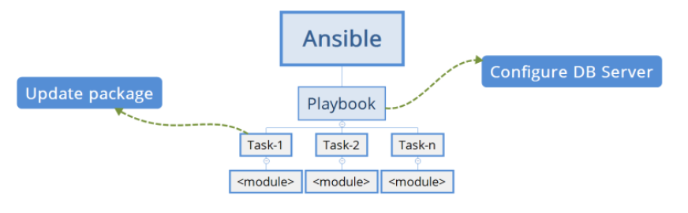
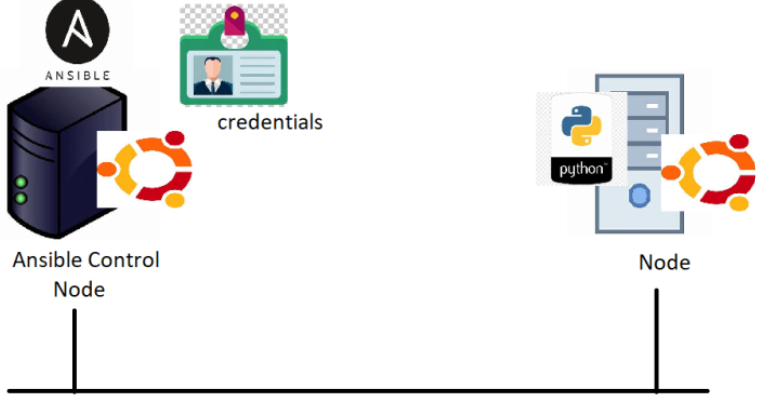
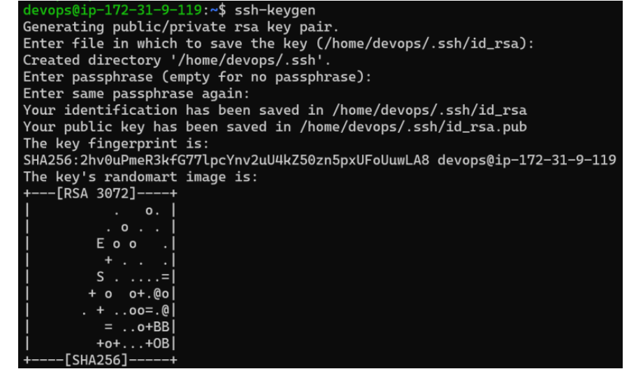
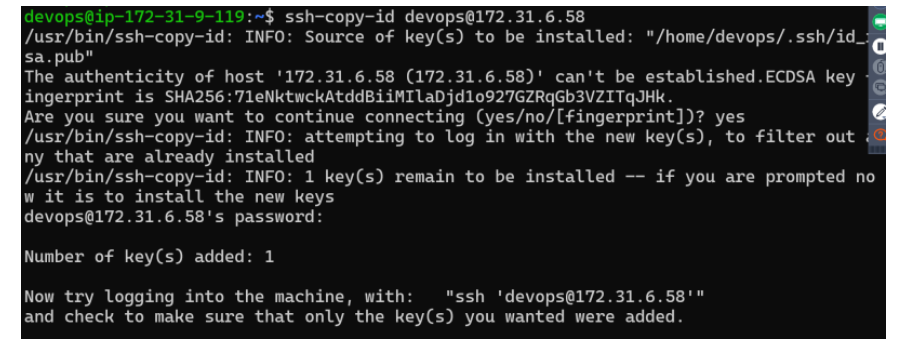
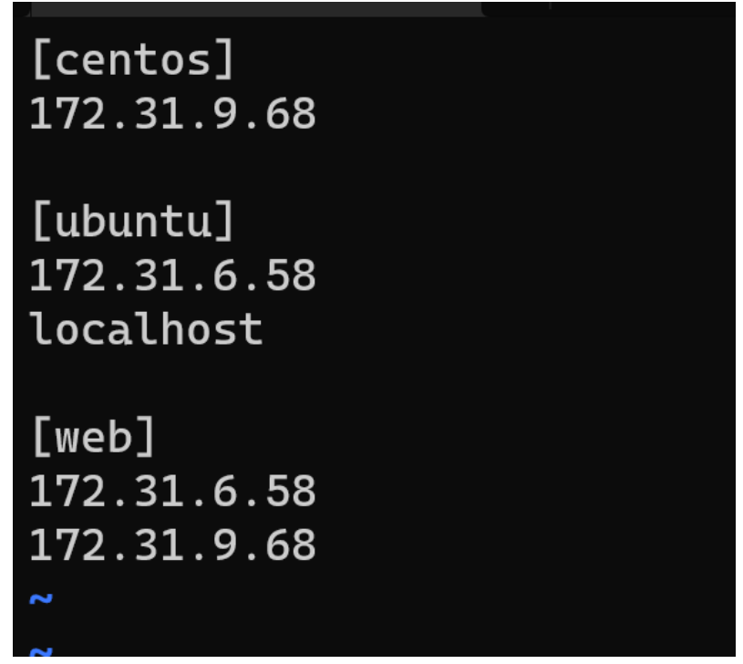
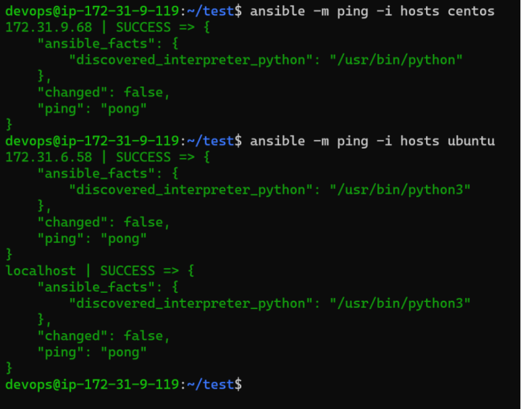

## Ansible defination:

* Ansible is an open-source IT automation tool that helps you manage and configuring systems, deploying software and install softwares and perform IT tasks
* Ansible maintains the list of nodes to be communicated and is referred as inventory.
* Ansible is push configuration management.
* To write the declarative configuation, Ansible used YAML and calls it as Playbook.

## what are the possible to install or deploy the application:

* Admins have permissions to deploy the application manually.
* write scripts like shell/powershell to deploy the application.
* Using decleartive approch like configuration management to deploy the application. 

## Test enviroments in ansible:

* Dev Environment: This environment needs to deployed for every change done by dev team.
* System Test Environment: This environment needs to be deployed once every day at 11:00 PM
* Performance Test Environment : This environment needs to be deployed once every day at 1:00 AM
* UAT (User Acceptance Testing)/Pre-Prod/Staging: This we deploy every weekend i.e. saturday 6:00 AM

## configuration management 
* configuartion management has two methods:
   * pull: In pull Cm nodes initiate the communication to the cm server.
       * In PULL BASED CM, An agent is installed on every node which is responsible for initiating the communication and following instructrions from CM Server 
   * push: In push Cm initiate the communication to the nodes.
       * In PUSH BASED CM, CM Server has admin credentials of the node and the details like ip adress/hostname to login and execute the declarative configuration.

## Ansible requirements

* Configuration Management Server in the case of ansible can be very light weight machin.
* Ansible logs in to the nodes and executes the declarative configuration & for that it requires python to be installed on the node.

## Approach

* Make a note all the manual steps for deploying the application.
* For each step find the command and convert that into declaration (Module).
* 
* [ReferHere](https://docs.ansible.com/ansible/2.9/modules/list_of_all_modules.html) for all modules.
  
## playbook syntax
```
---
- name: <describe your playbook here>
  tasks:
    - name: <what this task is about>
      <module>:
         <module-parameter-1>: <module-value-1>
         ..
         <module-parameter-n>: <module-value-n>
         state: <value (present)>
    - name: <what this task is about>
      <module>:
         <module-parameter-1>: <module-value-1>
         ..
         <module-parameter-n>: <module-value-n>
         state: <value (present)>
```
## Ansible Installation and configuration

* 
* AWS machines have passwords disabled by default. So lets enable password.(sudo vi /etc/ssh/sshd_config password=yes)
* And add the user to sudoers file (sudo visudo)
* same setup in node install agent passwd and sudoers file.

## Installing the ansible 

```
sudo apt update
sudo apt install software-properties-common
sudo add-apt-repository --yes --update ppa:ansible/ansible
sudo apt install ansible -y
ansible --version
```
## ansible commands 

```
ansible --version (check version)
ansible -i hosts -m ping -k all (to ping the hosts with password)
ansible -i hosts -m ping all (to ping the hosts with out password)
ansible-playbook -i inventoryfile yamlfile
```
## Adhoc

* In ansible we can excute activity by using adhoc commands 
  * good for rare activities for but history can not be maintained we also use any module by adhoc command.
  * Adhoc command for creating a file:
  ``` 
   ansible -m <module-name> -a <parameters/arguments> -i <inventory> all
   ansible -m ansible.builtin.file -a 'path=/tmp/1.txt state=touch' all
  ```     
## yaml playbook 

* declaring the whole deployment as a yaml file.
 *good for automating things used for multiple tyms and history can maintained for everychange in the playbook.

[Refer Here](https://docs.ansible.com/ansible/latest/reference_appendices/YAMLSyntax.html) for yaml.

 ```
 ---
   - name: learning playbooks
     hosts: all
     become: no
     tasks:
       - name: create a empty file
         ansible.builtin.file:
         path: /tmp/1.txt
         state: touch
 ```
 * become is no coz for creating file sudo permission is not mandatory.

## tomcat installation

* manual steps
```
sudo apt update
sudo apt install openjdk-8-jdk -y
sudo apt install tomcat9 -y
wget https://referenceapplicationskhaja.s3.us-west-2.amazonaws.com/gameoflife.war
sudo cp gameoflife.war /var/lib/tomcat9/webapps/
sudo systemctl restart tomcat9.service

```
* playbook for tomcat installation:
```
---
- name: deploy game of life
  become: yes
  hosts: all
  tasks:
    - name: update ubuntu packages
      ansible.builtin.apt:
        name: openjdk-8-jdk
        update_cache: yes
        state: present
    - name: install tomcat9
      ansible.builtin.apt:
        name: tomcat9
        state: present
    - name: download the gameoflife war file
      ansible.builtin.get_url:
        dest: /var/lib/tomcat9/webapps/gameoflife.war
        url: https://referenceapplicationskhaja.s3.us-west-2.amazonaws.com/gameoflife.war
    - name: restart tomcat9 service
      ansible.builtin.systemd:
        enabled: yes
        name: tomcat9
        state: restarted    
```
* create a file in the path /var/www/html/info.php with content <?php 
  phpinfo( ); ?>
* [Refer Here](https://docs.ansible.com/ansible/latest/collections/ansible/builtin/apt_module.html) for apt,get_url,service modules.

## same stuff to be installed on linux os.

```
- name: install php packages
  ansible.builtin.yum:
    name:
      - php
      - php-mysql
    state: present
```
## Configuring Password Less Authentication

``` 
ssh-keygen 
ssh-copy-id nodeuser@privateip

```



* We create a public/private key pair in the Ansible control node, Then we copy the public key to the nodes which ansible will connect
* Create a keypair in the ansible control node as a devops user.


## Inventory files in ansible

* when ansible is installed a default inventory file is created ***/etc/ansible/hosts***.
* when ansible is installed a default config file is created ***/etc/ansible/ansible.cfg*** .

* [Refer Here](https://github.com/ansible/ansible/blob/stable-2.9/examples/ansible.cfg) for default inventory config file.
  
* Inventory file in ansible can be written in two formats.
   * ini format
   * yaml format
*  for ini format inventory.
*  for pinging the particular hosts in inventory file.
* The above inventories are called as static inventories, there are ways to create dynamic inventories as well.
* Inventory file can have groups. An entry can be duplicate in many groups.
* The ideal way of dealing with inventory files is to create a inventory file with the name of the environment and ensure the groups names are consistent across different inventories
  * systemtest_hosts
  * performancetests_hosts
  * pre_prod_hosts
  * prod_hosts

  


