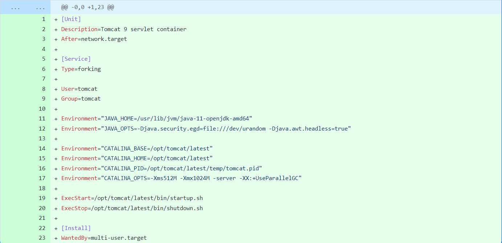
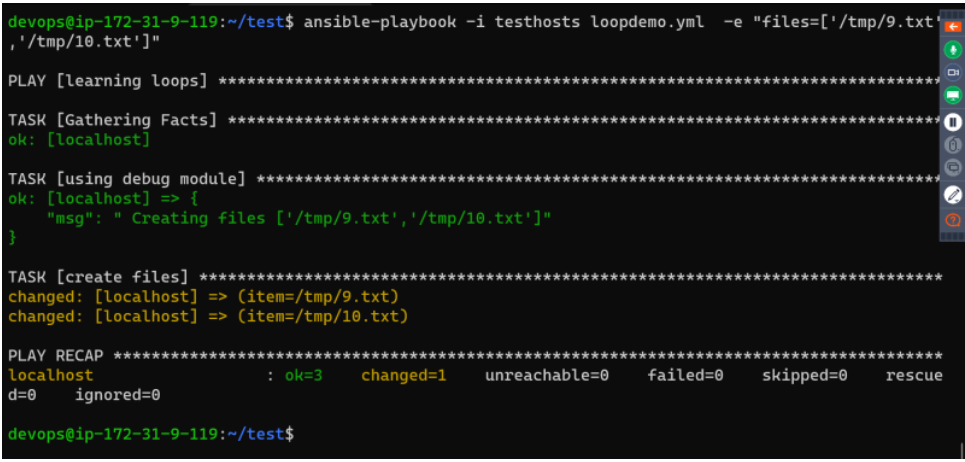
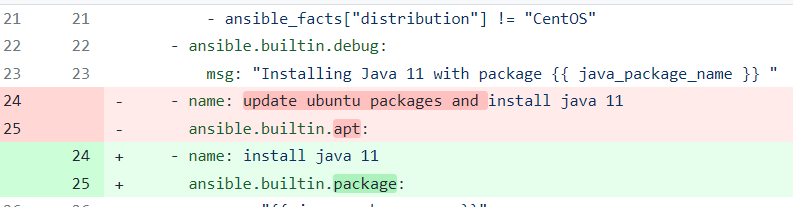
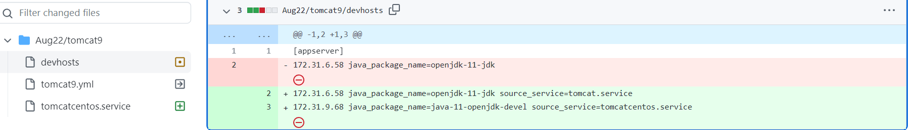
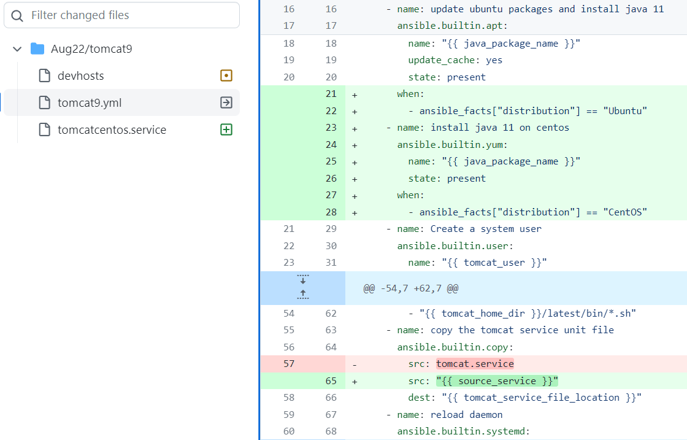
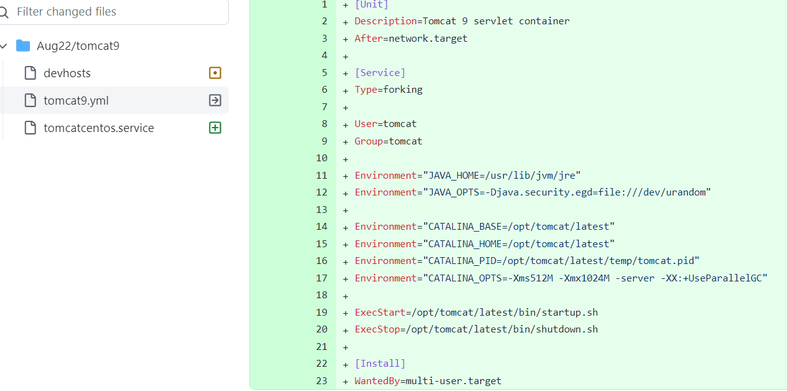
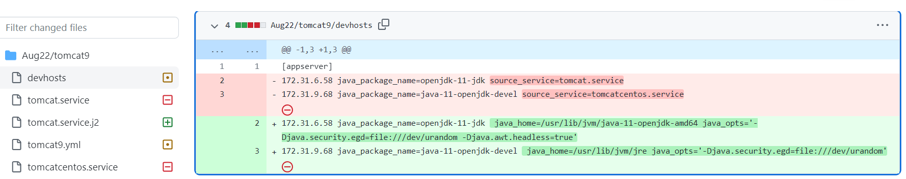
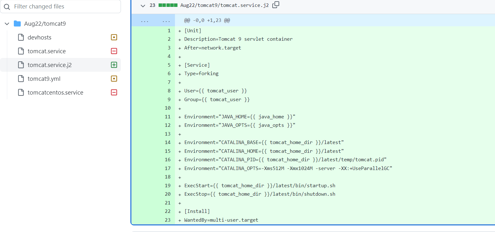
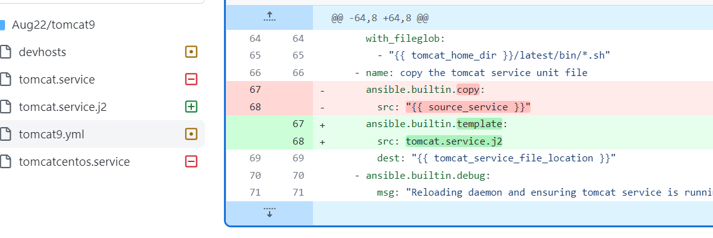

## Ansible defination:

* Ansible is an open-source IT automation tool that helps you manage and configuring systems, deploying software and install softwares and perform IT tasks
* Ansible maintains the list of nodes to be communicated and is referred as inventory.
* Ansible is push configuration management.
* To write the declarative configuation, Ansible used YAML and calls it as Playbook.

## what are the possible to install or deploy the application:

* Admins have permissions to deploy the application manually.
* write scripts like shell/powershell to deploy the application.
* Using decleartive approch like configuration management to deploy the application. 

## Test enviroments in ansible:

* Dev Environment: This environment needs to deployed for every change done by dev team.
* System Test Environment: This environment needs to be deployed once every day at 11:00 PM
* Performance Test Environment : This environment needs to be deployed once every day at 1:00 AM
* UAT (User Acceptance Testing)/Pre-Prod/Staging: This we deploy every weekend i.e. saturday 6:00 AM

## configuration management 
* configuartion management has two methods:
   * pull: In pull Cm nodes initiate the communication to the cm server.
       * In PULL BASED CM, An agent is installed on every node which is responsible for initiating the communication and following instructrions from CM Server 
   * push: In push Cm initiate the communication to the nodes.
       * In PUSH BASED CM, CM Server has admin credentials of the node and the details like ip adress/hostname to login and execute the declarative configuration.

## Ansible requirements

* Configuration Management Server in the case of ansible can be very light weight machin.
* Ansible logs in to the nodes and executes the declarative configuration & for that it requires python to be installed on the node.

## Approach

* Make a note all the manual steps for deploying the application.
* For each step find the command and convert that into declaration (Module).
* 
* [ReferHere](https://docs.ansible.com/ansible/2.9/modules/list_of_all_modules.html) for all modules.
  
## playbook syntax
```
---
- name: <describe your playbook here>
  tasks:
    - name: <what this task is about>
      <module>:
         <module-parameter-1>: <module-value-1>
         ..
         <module-parameter-n>: <module-value-n>
         state: <value (present)>
    - name: <what this task is about>
      <module>:
         <module-parameter-1>: <module-value-1>
         ..
         <module-parameter-n>: <module-value-n>
         state: <value (present)>
```
## Ansible Installation and configuration

* 
* AWS machines have passwords disabled by default. So lets enable password.(sudo vi /etc/ssh/sshd_config password=yes)
* And add the user to sudoers file (sudo visudo)
* same setup in node install agent passwd and sudoers file.

## Installing the ansible 

```
sudo apt update
sudo apt install software-properties-common
sudo add-apt-repository --yes --update ppa:ansible/ansible
sudo apt install ansible -y
ansible --version
```
## ansible commands 

```
ansible --version (check version)
ansible -i hosts -m ping -k all (to ping the hosts with password)
ansible -i hosts -m ping all (to ping the hosts with out password)
ansible-playbook -i inventoryfile yamlfile
```
## Adhoc

* In ansible we can excute activity by using adhoc commands 
  * good for rare activities for but history can not be maintained we also use any module by adhoc command.
  * Adhoc command for creating a file:
  ``` 
   ansible -m <module-name> -a <parameters/arguments> -i <inventory> all
   ansible -m ansible.builtin.file -a 'path=/tmp/1.txt state=touch' all
  ```     
## yaml playbook 

* declaring the whole deployment as a yaml file.
 *good for automating things used for multiple tyms and history can maintained for everychange in the playbook.

[Refer Here](https://docs.ansible.com/ansible/latest/reference_appendices/YAMLSyntax.html) for yaml.

 ```
 ---
   - name: learning playbooks
     hosts: all
     become: no
     tasks:
       - name: create a empty file
         ansible.builtin.file:
         path: /tmp/1.txt
         state: touch
 ```
 * become is no coz for creating file sudo permission is not mandatory.

## tomcat installation

* manual steps
```
sudo apt update
sudo apt install openjdk-8-jdk -y
sudo apt install tomcat9 -y
wget https://referenceapplicationskhaja.s3.us-west-2.amazonaws.com/gameoflife.war
sudo cp gameoflife.war /var/lib/tomcat9/webapps/
sudo systemctl restart tomcat9.service

```
* playbook for tomcat installation:
```
---
- name: deploy game of life
  become: yes
  hosts: all
  vars:
  tomcat_home_dir: /opt/tomcat
  tomcat_user: tomcat
  tomcat_default_shell: /bin/false
  tomcat_download_url: https://dlcdn.apache.org/tomcat/tomcat-9/v9.0.65/bin/apache-tomcat-9.0.65.tar.gz
  tomcat_download_location: /tmp/apache-tomcat-9.0.65.tar.gz
  tomcat_service_file_location: /etc/systemd/system/tomcat.service
  tasks:
    - name: update ubuntu packages
      ansible.builtin.apt:
        name: openjdk-8-jdk
        update_cache: yes
        state: present
    - name: install tomcat9
      ansible.builtin.apt:
        name: tomcat9
        state: present
    - name: download the gameoflife war file
      ansible.builtin.get_url:
        dest: /var/lib/tomcat9/webapps/gameoflife.war
        url: https://referenceapplicationskhaja.s3.us-west-2.amazonaws.com/gameoflife.war
    - name: Create a system user
      ansible.builtin.user:
        name: "{{ tomcat_user }}"
        create_home: yes
        home: "{{ tomcat_home_dir }}"
        shell: "{{ tomcat_default_shell }}"
    - name: download tomcat
      ansible.builtin.get_url:
        url: "{{ tomcat_download_url }}"
        dest: "{{ tomcat_download_location }}"
    - name: extract tomcat
      ansible.builtin.unarchive:
        src: "{{ tomcat_download_location }}"
        dest: "{{ tomcat_home_dir }}"
        remote_src: yes
    - name: create symbolic link
      ansible.builtin.file:
        src: "{{ tomcat_home_dir }}/apache-tomcat-9.0.65"
        dest: "{{ tomcat_home_dir }}/latest"
        owner: "{{ tomcat_user }}"
        group: "{{ tomcat_user }}"
        state: link
    - name: print all shell files
      file:
        path: "{{ item }}"
        mode: "+x"
      with_fileglob:
        - /tmp/test/*.sh 
    - name: copy the tomcat service unit file
      ansible.builtin.copy:
        src: tomcat.service
        dest: "{{ tomcat_service_file_location }}"                   
  handlers:
    - name: restart tomcat
      ansible.builtin.systemd:
        name: tomcat
        state: restarted
    - name: extract tomcat
      ansible.builtin.unarchive:
        src: "{{ tomcat_download_location }}"
        dest: "{{ tomcat_home_dir }}"
        remote_src: yes  
```
* create a file in the path /var/www/html/info.php with content <?php 
  phpinfo( ); ?>
* [Refer Here](https://docs.ansible.com/ansible/latest/collections/ansible/builtin/apt_module.html) for apt,get_url,service modules.

* sh chmod: The problem with this approach is, it is not idempotent. So the command will be executed every time ansible playbook is executed.
  
  * TO get out from this approch we use lookups and registering variables.
  *  for tomcat.service
  * [Refer Here](https://github.com/asquarezone/AnsibleZone/commit/d68f5f9e20ce08e7a888d9bf83c53cd4d05d7d16) for user.xml,manager,hostmanager.
## same stuff to be installed on linux os.

```
- name: install php packages
  ansible.builtin.yum:
    name:
      - php
      - php-mysql
    state: present
```
## Configuring Password Less Authentication

``` 
ssh-keygen 
ssh-copy-id nodeuser@privateip

```


* We create a public/private key pair in the Ansible control node, Then we copy the public key to the nodes which ansible will connect
* Create a keypair in the ansible control node as a devops user.


## Inventory files in ansible

* when ansible is installed a default inventory file is created ***/etc/ansible/hosts***.
* when ansible is installed a default config file is created ***/etc/ansible/ansible.cfg*** .

* [Refer Here](https://github.com/ansible/ansible/blob/stable-2.9/examples/ansible.cfg) for default config file.
  
* Inventory file in ansible can be written in two formats.
   * ini format
   * yaml format
*  for ini format inventory.
*  for pinging the particular hosts in inventory file.
* The above inventories are called as static inventories, there are ways to create dynamic inventories as well.
* Inventory file can have groups. An entry can be duplicate in many groups.
* The ideal way of dealing with inventory files is to create a inventory file with the name of the environment and ensure the groups names are consistent across different inventories
  * systemtest_hosts
  * performancetests_hosts
  * pre_prod_hosts
  * prod_hosts

## variables in ansible 

* Variables in Ansible can be declared in
  * playbook 
  * inventory file
  * many other location 

* [Refer Here](https://docs.ansible.com/ansible/latest/playbook_guide/playbooks_variables.html#:~:text=Ansible%20uses%20variables%20to%20manage,syntax%2C%20including%20lists%20and%20dictionaries.)

## Ansile loops:

* Ansible supports loops as well.
* Ansible offers the loop, with_<lookup>, and until keywords to execute a task multiple times.

```

---
- name: learning loops
  become: no
  hosts: all
  tasks:
    - name: create files
      file: 
        path: "{{ item }}"
        state: touch
      loop:
        - /tmp/1.txt
        - /tmp/2.txt
        - /tmp/3.txt

```
## defining the varibles from loops:

```
- name: learning loops
  become: no
  hosts: all
  vars:
    files:
      - /tmp/4.txt
      - /tmp/5.txt
      - /tmp/6.txt
  tasks:
    - name: create files
      file: 
        path: "{{ item }}"
        state: touch
      loop: "{{ files }}"

```
## debug module in ansible 

```
- name: learning loops
  become: no
  hosts: all
  vars:
    files:
      - /tmp/4.txt
      - /tmp/5.txt
      - /tmp/6.txt
  tasks:
    - name: using debug module
      ansible.builtin.debug:
        msg: " Creating files {{ files }}"
    - name: create files
      ansible.builtin.file: 
        path: "{{ item }}"
        state: touch
      loop: "{{ files }}"
```
* This module prints statements during execution and can be useful for debugging variables or expressions without necessarily halting the playbook.

* Useful for debugging together with the ‘when:’ directive.

* This module is also supported for Windows targets.

## debug with the variables:

*  we can change the vars in the cli.   

## Anisble lookups

* Ansible lookups will pull the data based on the lookup plugin.
* [Refer Here](https://docs.ansible.com/ansible/latest/collections/index_lookup.html) for lookups.

## fileblob:

* File glob lookup can lookup for files in a directory with some pattern.
* from the below example, let us fileglob pattern to find all the .sh files.
```
---
- name: learning lookups
  become: no
  hosts: all
  tasks:
    - name: print all shell files
      debug:
        msg: "{{ item }}"
      with_fileglob:
        - /tmp/test/*.sh
```
## Handlers in ansible 

* Sometimes you want a task to run only when a change is made on a machine.
* Ansible uses handlers to address this use case. Handlers are tasks that only run when notified.

```
  handlers:
    - name: restart tomcat
      ansible.builtin.systemd:
        name: tomcat
        state: restarted
    - name: extract tomcat
      ansible.builtin.unarchive:
        src: "{{ tomcat_download_location }}"
        dest: "{{ tomcat_home_dir }}"
        remote_src: yes
```
## notify module:
* when ever we run the playbook multiple task were re-running.So,in this case we will be using handlers to trigger a handler we use nofity module to excute the task.
```
    - name: restart tomcat
      ansible.builtin.systemd:
        name: tomcat
        state: restarted
      notify:
        - restart tomcat  
  handlers:
    - name: restart tomcat
      ansible.builtin.systemd:
        name: tomcat
        state: restarted
    - name: extract tomcat
      ansible.builtin.unarchive:
        src: "{{ tomcat_download_location }}"
        dest: "{{ tomcat_home_dir }}"
        remote_src: yes
```
## Flush handlers
*  Ansible inserts these tasks internally at certain points to implicitly trigger handler runs (after pre/post tasks, the final role execution, and the main tasks section of your plays)
```
    - name: extract tomcat
      ansible.builtin.unarchive:
        src: "{{ tomcat_download_location }}"
        dest: "{{ tomcat_home_dir }}"
        remote_src: yes
    - name: Flush handlers
      meta: flush_handlers  
    - name: restart tomcat
      ansible.builtin.systemd:
        name: tomcat
        state: restarted
      notify:
        - restart tomcat  
  handlers:
    - name: restart tomcat
      ansible.builtin.systemd:
        name: tomcat
        state: restarted
    - name: extract tomcat
      ansible.builtin.unarchive:
        src: "{{ tomcat_download_location }}"
        dest: "{{ tomcat_home_dir }}"
        remote_src: yes
``` 
## fail module
* fail module is used to fail the excution when the a particular os is not mentioned in the playbook.

```
    - name: Fail on unsupported operating systems
      ansible.builtin.fail:
        msg: This playbook supports only Ubuntu and Centos
      when:
        - ansible_facts["distribution"] != "Ubuntu"
        - ansible_facts["distribution"] != "CentOS"
```

## Debug module 

```
- name: debug module 
  debug:
    msg: creating files for the demo "{{ item }}
```
## package module 



* This module is use to taken the target without specifying a package manage module like yum,apt.
* it is an hetrogenous enviroment.
* varibles can be define in inventory with the same name.

```
- name: update ubuntu packages and install java 11
      ansible.builtin.apt:
        name: "{{ java_package_name }}"
        update_cache: yes
        state: present
      when:
        - ansible_facts["distribution"] == "Ubuntu"
- name: install java 11 on centos
    ansible.builtin.yum:
    name: "{{ java_package_name }}"
    state: present
    when:
    - ansible_facts["distribution"] == "CentOS
```
* insted of using the yum and apt in ansible.Best resource is use to package module to run in any enviroment.    


## ansible facts

* Ansible facts are data related to your remote systems, including operating systems, IP addresses, attached filesystems, and more. You can access this data in the ansible_facts variable. By default, you can also access some Ansible facts as top-level variables with the ansible_ prefix.
* this secnario is useful to run the playbook an particular machine.by using when condition in playbook .by using when condition can run on different machine.
```
ansible -m setup -i hosts ubuntu

```
* [Refer Here](https://docs.ansible.com/ansible/latest/playbook_guide/playbooks_vars_facts.html) for ansible facts.
* ansible supports conditionls using when.[Refer Here](https://docs.ansible.com/ansible/latest/playbook_guide/playbooks_conditionals.html) for when condition.
* ansible facts are collected by using setup module.
* [Refer Here](https://github.com/asquarezone/AnsibleZone/commit/b9886f6dc16b063f92fb62abaea1498bb3e4c7d4) for ansible facts.





* when i want to use the same playbook for multiple enviroments we use ansible facts to run playbook.

## jinja 2

* this is used to change or enable dynamic expression and access variable and facts .we can use template with template variable.

## ansible template 

* anisble template can be used to copy the files with dynamic data loaded from variables.

[Refer Here](https://docs.ansible.com/ansible/latest/collections/ansible/builtin/template_module.html)





## Ansiable inventory 

* inventory in ansible can be two formats 
   * ini
   * yaml format
* inventory can be static and dynamic.
* ini and yaml foramt are for static inventories.
* [Refer Here](https://docs.ansible.com/ansible/latest/inventory_guide/intro_inventory.html)
* [Refer Here](https://docs.ansible.com/ansible/latest/inventory_guide/intro_inventory.html#organizing-host-and-group-variables) for  organizing the host and inventory variables.  


